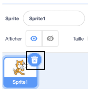
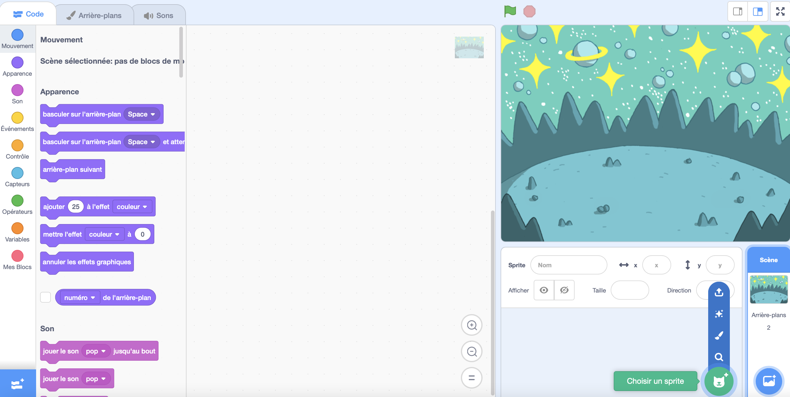
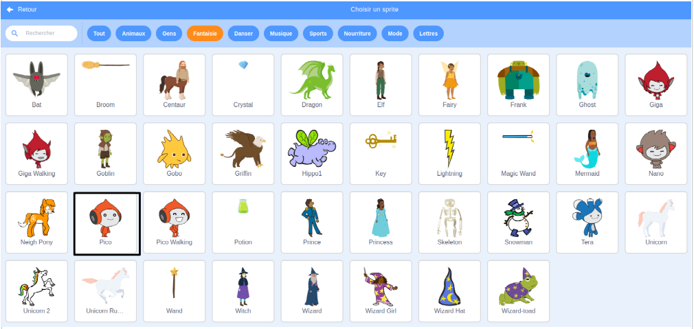
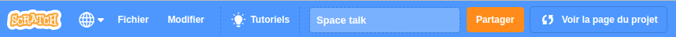
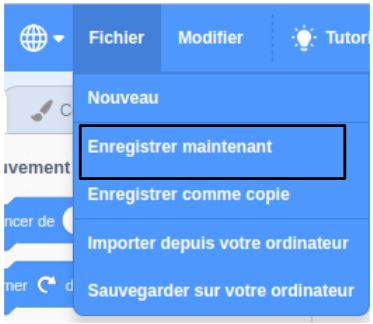

## Créer ta scène 

--- task ---

Ouvre le [projet de démarrage Space talk](https://scratch.mit.edu/projects/582213331/editor){:target="_blank"}. Scratch s'ouvrira dans un autre onglet du navigateur.

<video width="640" height="360" controls preload="none" poster="images/space-talk-placeholder.png">
<source src="images/en-ST-step2-add-backdrop.mp4" type="video/mp4">
Your browser does not support WebM video, try FireFox or Chrome
</video>

[[[working-offline]]]

--- /task ---

--- task ---

Choisir un **arrière-plan**:

<video width="640" height="360" controls preload="none" poster="images/space-talk-placeholder.png">
<source src="images/fr-ST-step2-add-backdrop.mp4" type="video/mp4">
Your browser does not support WebM video, try FireFox or Chrome
</video>

--- /task ---

Peux-tu voir le sprite qui est déjà inclus dans ton projet ? C'est le chat Scratch.

--- task ---

Supprimer le sprite **sprite1** (Scratch Cat) : sélectionne le sprite **Sprite1** dans la liste Sprite sous la scène et clique sur l'icône **Supprimer**.

--- /task ---

--- task ---

Clique sur **Choisir un Sprite** dans la liste Sprite :

--- /task ---

--- task ---

Sélectionne la catégorie **Fantaisie**. Clique sur le sprite **Pico** pour les ajouter à ton projet.

--- /task ---

--- task ---

Fais glisser le sprite **Pico** pour les positionner sur le côté gauche de la scène. Ta scène devrait ressembler à ceci :

--- /task ---

--- task ---

Si tu es connecté à ton compte Scratch, clique sur le bouton vert Remix. Cela enregistrera une copie du projet sur ton compte Scratch.

Tape le nom de ton projet dans la zone nom du projet en haut de l'écran.

**Astuce :** Donne à tes projets des noms utiles afin de pouvoir les retrouver facilement lorsque tu as de nombreux projets.

Ensuite, clique sur **Fichier**, puis sur **Enregistrer maintenant** pour enregistrer ton projet.

Si tu n'es pas en ligne ou que tu n'as pas de compte Scratch, tu peux cliquer sur **Enregistrer sur ton ordinateur** pour enregistrer une copie de ton projet.

--- /task ---

